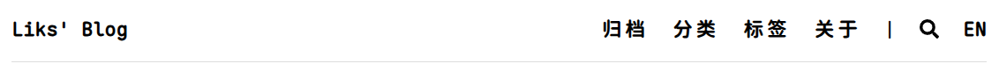
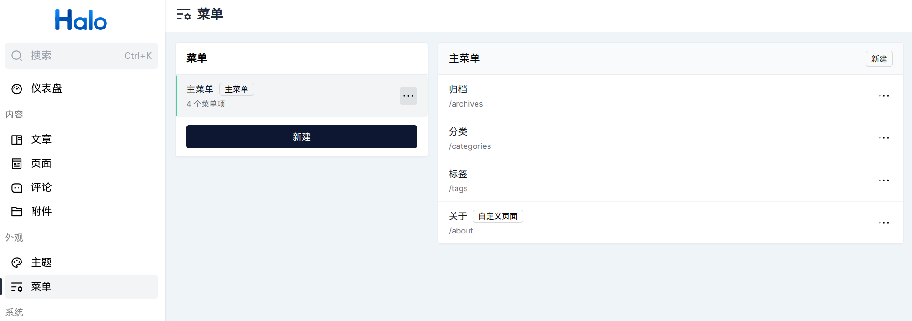
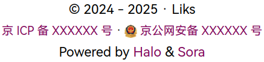
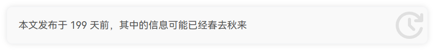
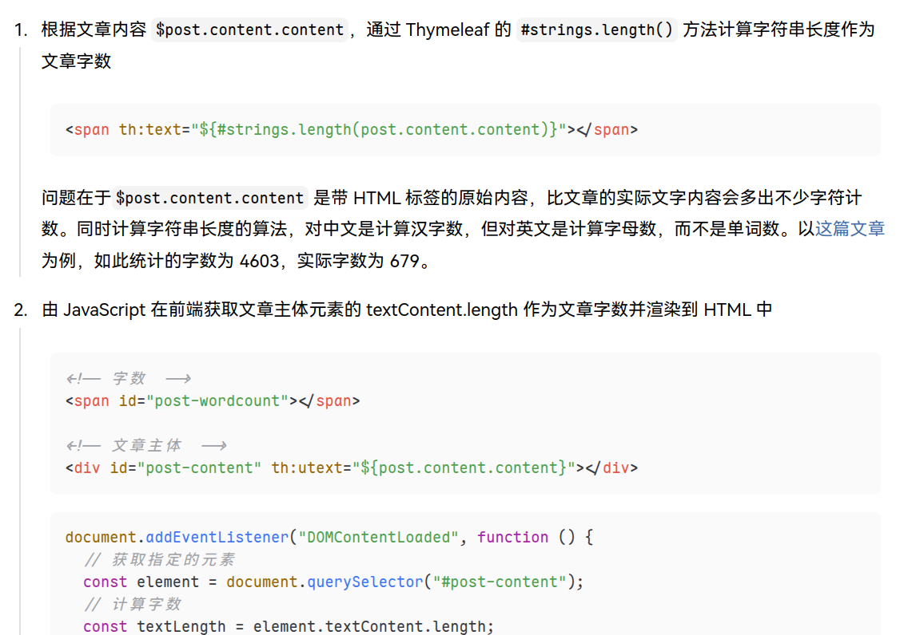
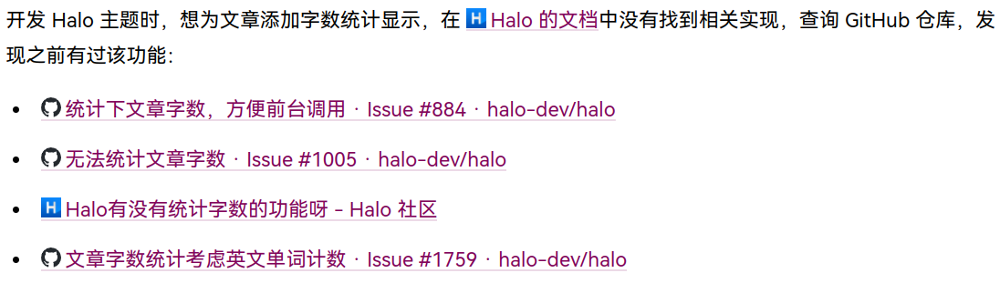
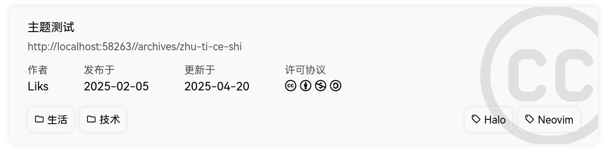
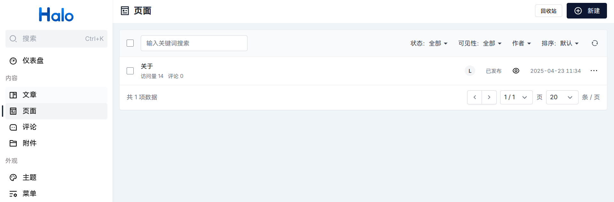

<h1 align="center">Sora</h1>

<p align="center">Sora 意为「穹」，象征着无限的可能性、广阔的空间和创造力<p>

<p align="center" style="color: #59636e;">若君喜欢这个主题，欢迎 🌟Star！</p>

# [预览](https://blog.liks.space)

## 谁在使用

欢迎提一个 [Issue](https://github.com/Liksone/halo-theme-sora/issues/new?template=addWebsite.yml) 来展示自己的网站。

- [Cirzear's Blog](http://blog.cirzear.cn/)
- [zuke blog](https://blog.zuke.chat/)
- [一叶轻舟](https://69.197.134.230)
- [风中的轩语](https://blog.moxuan.xin)

# 设计思路

> 一切从简，避免花哨。样式服务于内容的呈现。

## 配色

黑白灰打底，主色调 `#82045b`。

## 字体

<table>
  <tr>
    <th></th>
    <th>衬线</th>
    <th>非衬线</th>
    <th>等宽</th>
    <th>semi-serif</th>
  </tr>
  <tr>
    <td>中文</td>
    <td rowspan=3>思源宋体<br />Noto Serif SC</td>
    <td rowspan=3>HarmonyOS Sans SC</td>
    <td rowspan=3>Maple Mono NF CN</td>
    <td>霞鹜文楷</td>
  </tr>
  <tr>
    <td>英文</td>
    <td></td>
  </tr>
  <tr>
    <td>数字</td>
    <td></td>
  </tr>
</table>

HarmonyOS Sans SC 调用服务器本地字体，其他字体调用第三方 [CDN](https://fonts.zeoseven.com/)。

最后选择 `ui-serif`、`serif`，`ui-sans-serif`、`sans-serif`， `ui-monospace`、`monospace` 作为 fallback 字体。

## 导航栏



左侧显示站点标题。

右侧的分割线前显示一些页面，与 Halo 后台的菜单关联。支持主菜单下的子菜单。



分割线后显示搜索按钮和英文界面（待开发）。

## 页脚



首行是版权说明，格式为「© 建站时间 · 版权所有者」。

次行是备案号（可选）。

尾行是 Halo 和主题的链接。

## 评论系统

Halo 内置评论系统，但是有些功能缺失，例如无 Markdown 支持:

- [请求支持MarkDown语法 · Issue #141 · halo-dev/plugin-comment-widget](https://github.com/halo-dev/plugin-comment-widget/issues/141)
- [【Feature】希望插件能支持以下功能，这样就不用老是切换第三方评论系统了 · Issue #142 · halo-dev/plugin-comment-widget](https://github.com/halo-dev/plugin-comment-widget/issues/142)

因此增加了对静态博客常用的第三方评论系统 Artalk 的支持。

## 文章页

### 文章元信息

- 发布时间、更新时间

  yyyy-mm-dd 格式。当更新时间与发布时间是同一天时，只显示发布时间。

  私以为，发布时间与更新时间是体现文章时效性的重要元信息，有手动设定的需求。而 Halo 目前只支持手动设定发布时间，于是考虑通过文章的元数据来实现手动设定更新时间，详见[此文](https://blog.liks.space/archives/1743607499692)。

- 分类、标签
- 字数统计

  实现见[此文](https://blog.liks.space/archives/1744278269316)。

- 预计阅读时间

  取 WPM（Words Per Minute，每分钟阅读字数）为 250～350，用字数除以 WPM，结果四舍五入。

- 浏览量

### 时效性提示

提示读者此文的时效性，因为有些信息的价值随着时间的流逝会不断削减。



以更新时间（若有）或发布时间为准，显示距今的天数。

「春去秋来」部分的灵感源自[这里](https://ld246.com/article/1610896675951)，每次刷新网页时通过 JavaScript 从词库

```javascript
[
  "时过境迁",
  "沧海桑田",
  "天翻地覆",
  "水流花落",
  "斗转星移",
  "物是人非",
  "时移世易",
  "物换星移",
  "春去秋来",
];
```

中随机选取显示。

### 文章目录

Halo 没有内建目录支持，于是通过 JavaScript 从 HTML 提取标题来生成目录。支持 H1、H2、H3、H4 四级标题。

目录附着于文章右侧，跟随页面滚动，并高亮当前所在标题。

### 文章主体

#### 列表

对于较长的列表项，在左侧添加竖线以更加醒目。



#### 代码块

使用 `highlight.js` 代码高亮，需要在 Halo 后台开启[相应插件](https://www.halo.run/store/apps/app-sqpgf)。

#### 链接



通过 `background` 模拟下划线样式，并添加鼠标悬停时的样式。

通过 JavaScript 为站外链接在链接开头显示其 favicon。图标来源于

1. 通过 DevTools 寻找站点资源
2. 通过 `https://www.google.com/s2/favicons?domain=${domain}&sz=64` 获取

优先使用 SVG，其次 PNG。

### 尾部

#### 版权许可

采用卡片形式展示。包括文章的标题、链接、作者、发布与更新时间和许可。



#### 末尾分类 & 标签

> 应友人的建议：读者阅读到文章的末尾时，有时会想到继续浏览相关的其他文章，这时在末尾有分类和标签的链接就会很方便。

在「版权许可」中展示。

#### 赞赏


点赞功能的实现源自 [theme-earth](https://github.com/halo-dev/theme-earth/blob/main/src/alpine-data/upvote.ts)。点赞数据与 Halo 后端通信，通过 localStorage 来判断点赞状态，已点赞时按钮变灰。

赞助按钮点击弹出二维码和赞助名单（可选）。

## 分类页 & 标签页

采用小卡片并排。

单个分类 / 标签下的文章展示效果与首页一致。

## 关于页

通过自定义页面实现。




采用与文章页一致的排版。

# 致谢

- [Pedro-null/halo-theme-hingle2.0](https://github.com/Pedro-null/halo-theme-hingle2.0)
- [Aziteee/halo-theme-lapis](https://github.com/Aziteee/halo-theme-lapis)
- [纸鹿摸鱼处](https://blog.zhilu.cyou/)
- [HowieHz/halo-theme-higan-hz](https://github.com/HowieHz/halo-theme-higan-hz)
